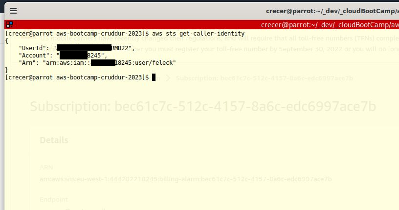
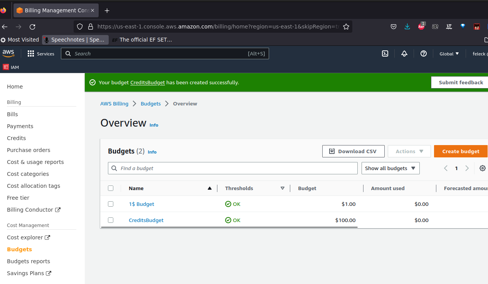
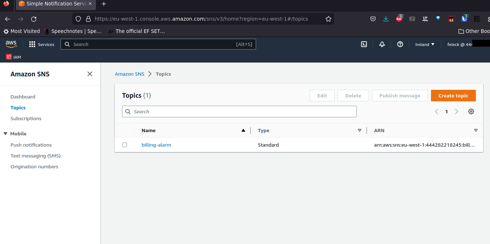
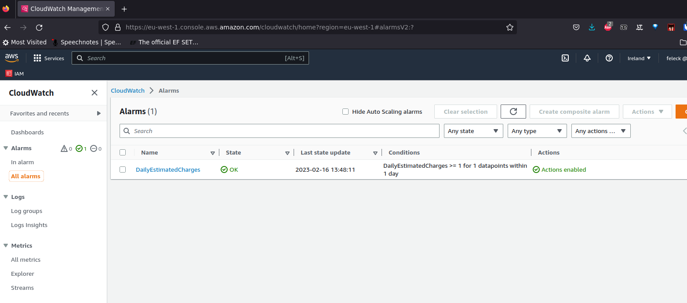
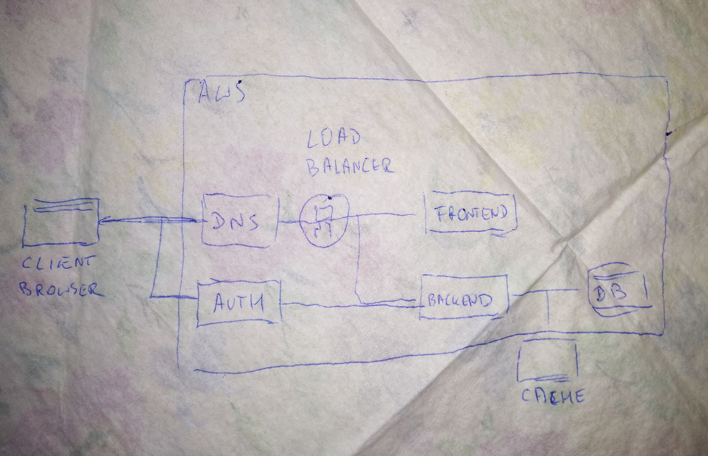
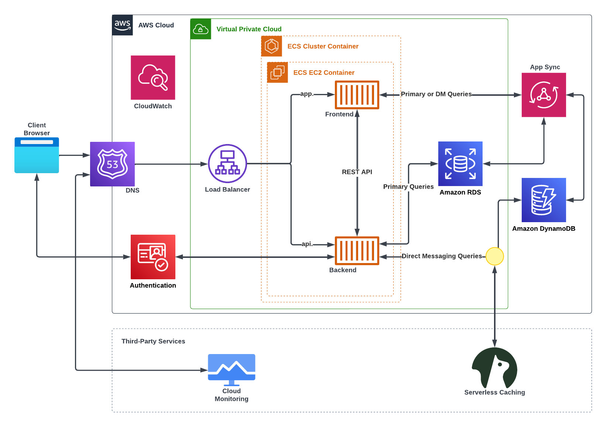
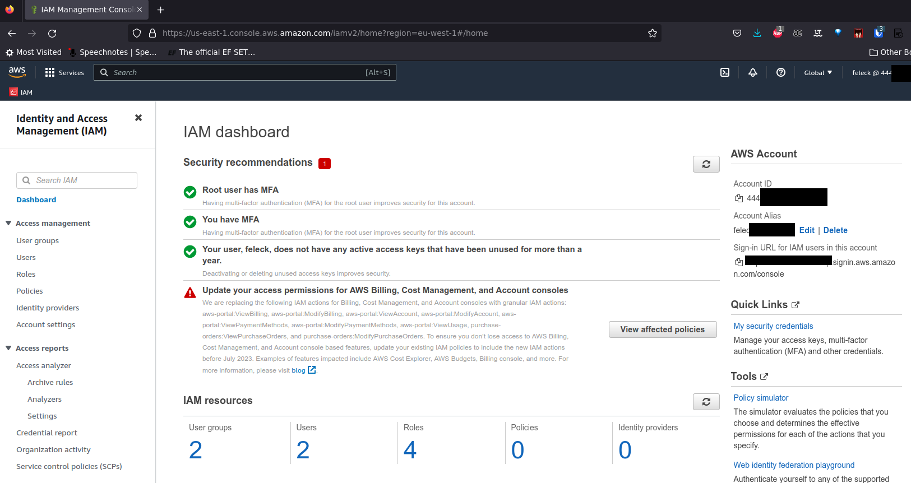
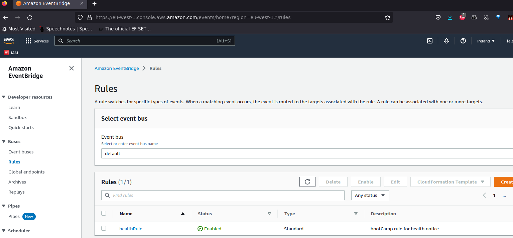

# Week 0 — Billing and Architecture

## Required Homework/Tasks

### Install and Verify AWS CLI

I used Gitpod as well as installed aws cli on my local (Arch Linux) machine, according [Installing or updating the latest version of the AWS CLI](https://docs.aws.amazon.com/cli/latest/userguide/getting-started-install.html) which was practically identical as installation on Gitpod.

It's more convinient for me to use local env - eg. it's easier to write this journal in local VSCode than on github, and not to spend Gitpod hours.

I modified the way I work with git - I create new branch and after work is finished I merdge the new branch into *main* - so still there is only one branch in github.

### Create a Budget and a Billing Alarm (with SNS notification)

I created my own Budget for $1 - using CLI and json files as instructed.
I also created a second Budget because I have credits which I want to watch.

After creating I had to change it by hand because it was immadietaly on alarm because of no sufficient data - alarm -> edit-> additional configuration - Missing data treatment

### Recreate Logical Architectural Deisgn

I made a draft of logical architecutre on napkin:

Then recreated (with slight modifications) Design in LucidChart:

Her's the link to [LucidCharts Diagram](https://lucid.app/lucidchart/6955042a-8be2-4642-a073-b69e98a0db59/edit?viewport_loc=-398%2C228%2C2446%2C1119%2C0_0&invitationId=inv_d35215a2-e4bc-4591-8021-c77bd1b582cf) with enabled comments.

***

## Homework Challenges

- Using IAM I created admin user (not to use root account), and secured both root and admin user with MFA. Then created another group (dev) and added permissions only to services witch we are going to use.

- As a part of gaining new experience I created an Organization with some OUs (inspired by Security Video).
- I reviewed the scope of Free Tier.
- I created a Trail in CloudTrail and after a day I deleted it - there occured some predicted spendings (about $0.01 per day) and instense S3 Requests.
- I reviewed the document [Well Architected Framework](https://docs.aws.amazon.com/pdfs/wellarchitected/latest/framework/wellarchitected-framework.pdf) and checked AWS Well-Architected Tool.
- I played arount with EventBridge. Read documentation [Monitoring AWS Health events with Amazon EventBridge](https://docs.aws.amazon.com/health/latest/ug/cloudwatch-events-health.html) and created new SNS topic with active email subscription:

