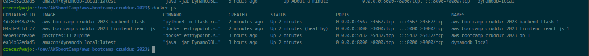
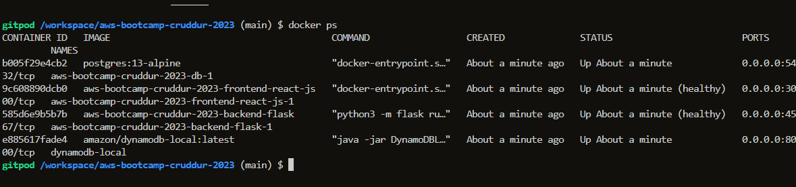
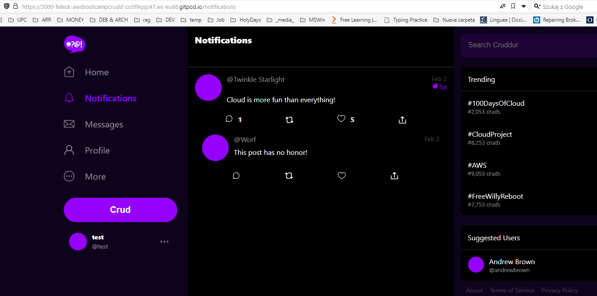
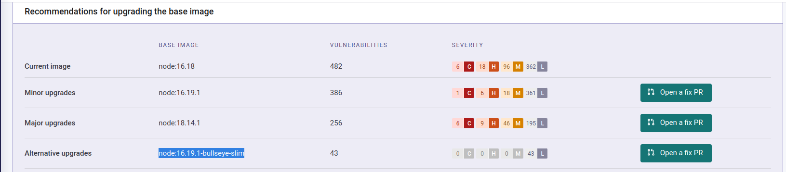
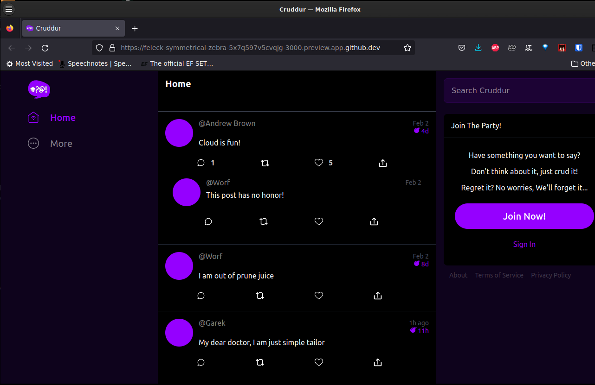
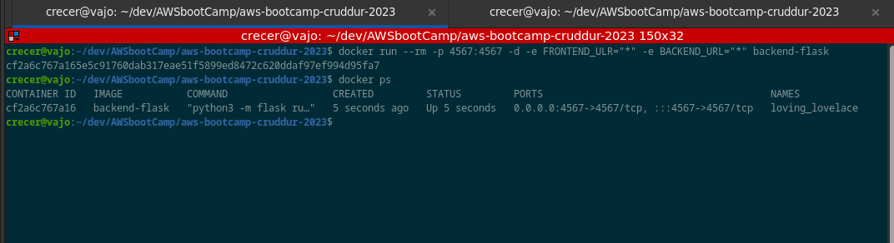
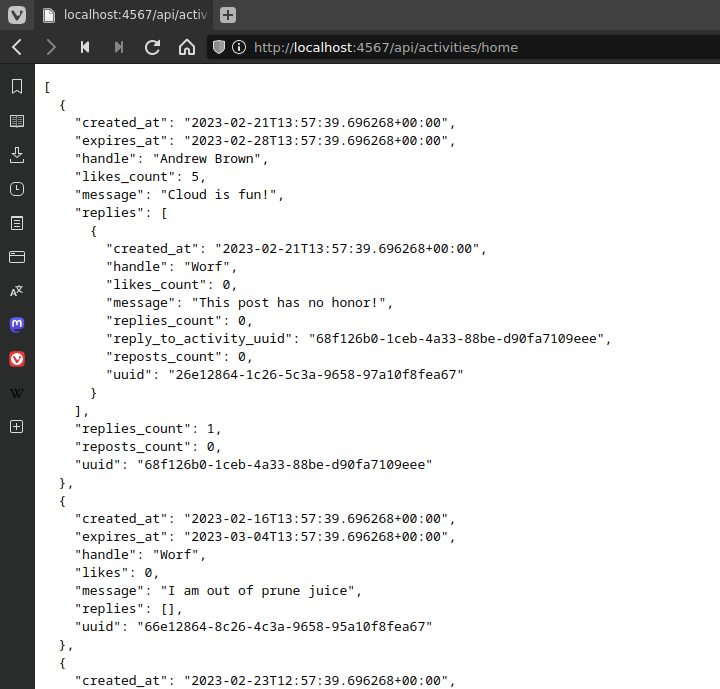
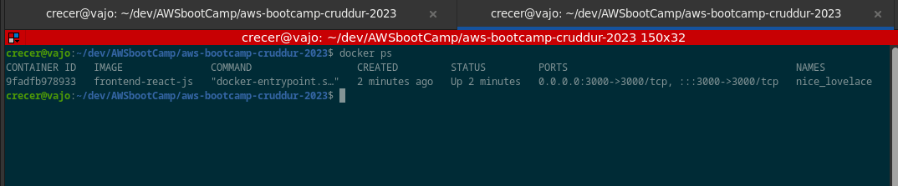
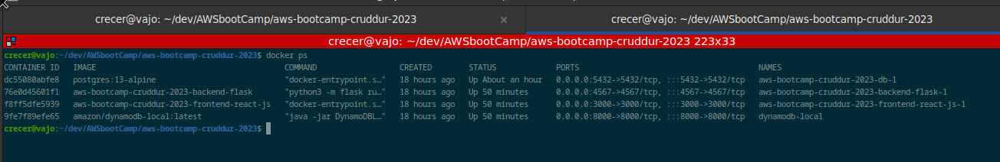
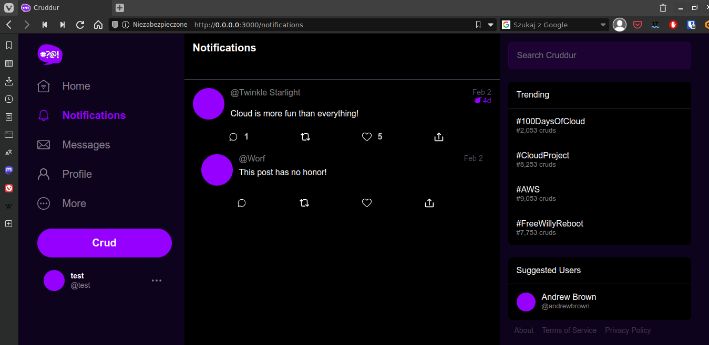

# Week 1 — Docker and App Containerization

## Required Homework/Tasks

I recreated all steps from instructional videos.

## Homework Challenges

### Use multi-stage building for a Dockerfile build

I watched and read some tutorial about multi-stage building for a Dockerfile build. I didn't have enought time to prepare proper Dockerfile for all app sub-services and implement more best practices.

### Implement a healthcheck in the V3 Docker compose file

I implemented frontend and backend healthcheck - needed to install curl - and recived  - on localhost

Then I tested app on gitpod after pushing changes to repo on github.


And website:



### Research best practices of Dockerfiles and attempt to implement it in your Dockerfile

I did some research on the best practices of Dockerfiles and attempted to implement a few of them in my Dockerfile.
I read a bunch of articles [Dockerfile best practices](https://dev.to/pavanbelagatti/dockerfile-best-practices-for-developers-mh2) or [Top 8 Docker best practices](https://dev.to/techworld_with_nana/top-8-docker-best-practices-for-using-docker-in-production-1m39).

Then I checked repo with snyk.io. and check if I can modify frontend Dockerfile - base image to node:16.19.1-bullseye-slim to reduce the number of vulnerabilities drastically.


I also modified the frontend - react app to run as *node* user (not as default root):
[react Dockerfile](https://github.com/feleck/aws-bootcamp-cruddur-2023/blob/main/frontend-react-js/Dockerfile)

### Learn how to install Docker on your localmachine and get the same containers running outside of Gitpod / Codespaces

I generally had no problems, I did play with docker some time ago.
I run an app first on **Codespaces**, had an issue with env variables, I had to put together an url for frontend and backend to talk to eachother:
On GITPOD:

```yml
FRONTEND_URL: "https://3000-${GITPOD_WORKSPACE_ID}.${GITPOD_WORKSPACE_CLUSTER_HOST}"
BACKEND_URL: "https://4567-${GITPOD_WORKSPACE_ID}.${GITPOD_WORKSPACE_CLUSTER_HOST}"
REACT_APP_BACKEND_URL: "https://4567-${GITPOD_WORKSPACE_ID}.${GITPOD_WORKSPACE_CLUSTER_HOST}"
```

whereas on Codespaces:

```yml
FRONTEND_URL: "https://${CODESPACE_NAME}-3000.${GITHUB_CODESPACES_PORT_FORWARDING_DOMAIN}"
BACKEND_URL: "https://${CODESPACE_NAME}-4567.${GITHUB_CODESPACES_PORT_FORWARDING_DOMAIN}"
REACT_APP_BACKEND_URL: "https://${CODESPACE_NAME}-4567.${GITHUB_CODESPACES_PORT_FORWARDING_DOMAIN}"
```

I finally managed to run the app on Codespaces:

Than added notifications part and DataBases also on Codespaces.
When recreating on gitpod - I forgot to run *npm i* in frontend-react-js directory.
But finally all changes (notifications, DynamoDB and PostgreSQL) and app running on gitpod.

Later on **local machine** (debian) according to security best practices as non-root user.

At first 

and 

and .

Later on I run app using *docker compose up* and docker-compose.yml file - 

